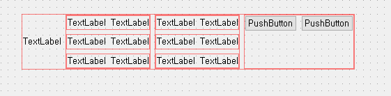

# 🚀 [파이썬 게임 만들기] - [0514]

## ✅ 오늘 한 작업
- 기존의 코딩한거 다 갈아엎고 다시 만들기
  - pickle, 상속을 이용해서 조금 더 구체적으로 class를 나누고 모듈화
- PyQt5를 통해 GUI 작업
- 메인 메뉴 만들기
- 새로 만들기
- 새로 만들고 불러오기 갔을 때 데이터 불러오기
  > 
    
- 데이터 삭제했을 때 새로고침해서 변경사항 불러오기
    > .gif>)

- 장비 창 만들기, 데이터 불러오기
> 

## 🔍 발생한 문제 & 해결 방법
- 화면을 전환하는데 새로운 창이 켜졌다.
  창을 stackwidget으로 만들어 전환하였다.
- 새로 만들기, 불러오기에서 버튼을 누르면 게임 시작 화면으로 넘어간다.

- 캐릭터 불러오기를 하는데 데이터가 하나만 있는 경우에 그 데이터가 차지하는 크기가 너무 컸다.
  그래서 gridlayout으로 구성했다.

## 🎯 내일 할 일
- 인벤토리에서 아이템 클릭시 아이템 상세정보 표시
- 장비 버튼 만들어서 클릭시 현재 착용하고 있는 장비 표시

## 🤔 회고
- 잘한 점, 개선할 점

## 파일
https://github.com/dlsdud9098/advanture_game