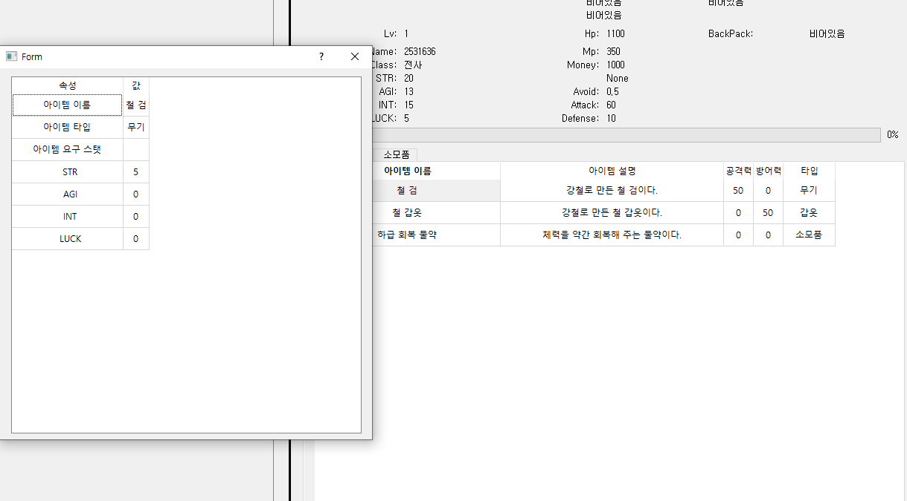

# 🚀 [파이썬 게임 만들기] - [0516]

## ✅ 오늘 한 작업
- 소모품 탭 만들기
- 포션을 대비해서 아이템 데이터에 hp, mp 추가
- 아이템(장비) 착용 여부 데이터 넣기
- 아이템 착용시 스텟, 공격 변화
- 아이템 착용시 장비칸에 아이템 텍스트 넣기
  > 
- 반지 왼손, 오른손 착용

- 아이템 상세보기 클릭시 새 창 띄우기
  > 

- 아이템 착용 할 때 이미 아이템을 착용하고 있으면 갈아 끼우기
  > 

## 🔍 발생한 문제 & 해결 방법
- 장비 하나를 우클릭 하고 다음 장비를 우클릭하면 오류가 발생했다.  
    => 메뉴를 안누르면 None이 나오게 한다.

- 미스릴 검을 착용한다. -> 철 검을 착용한다.
   => 와! 미스릴 검이 철 검으로 변해서 들어왔어요!
    => setText()순서를 바꿨더니 해결되었다.
      => 근대 스텟이나 공격력 등 수치 변화가 그대로다
        => 노가다로 뺐다.

## 🎯 내일 할 일
- 코드 갈아 엎기

## 🤔 회고
- 어떻게 만들긴 했는데 너무 길고, 복잡해졌다. 모듈화하던가 해서 좀 깔끔하게 수정을 해야할 것 같다.

## 파일
https://github.com/dlsdud9098/advanture_game